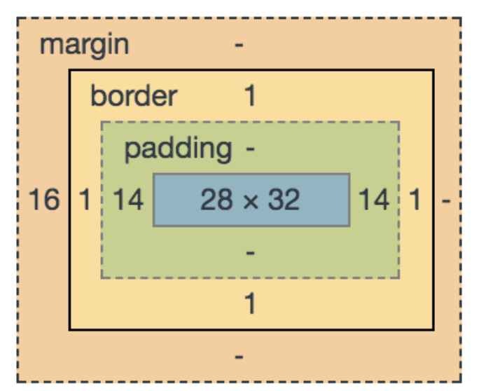
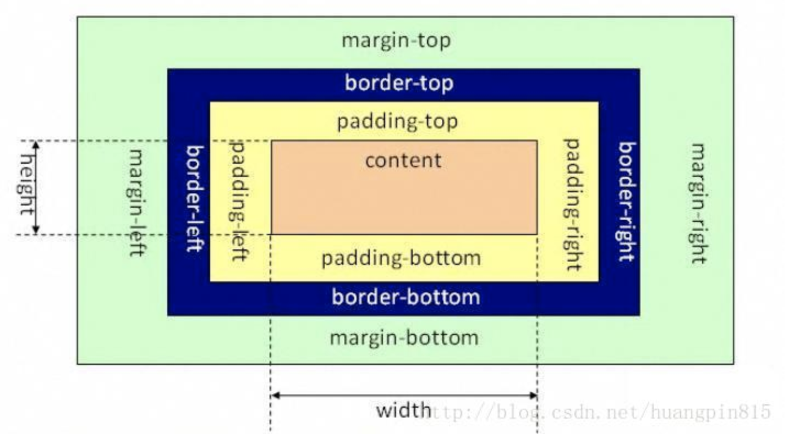
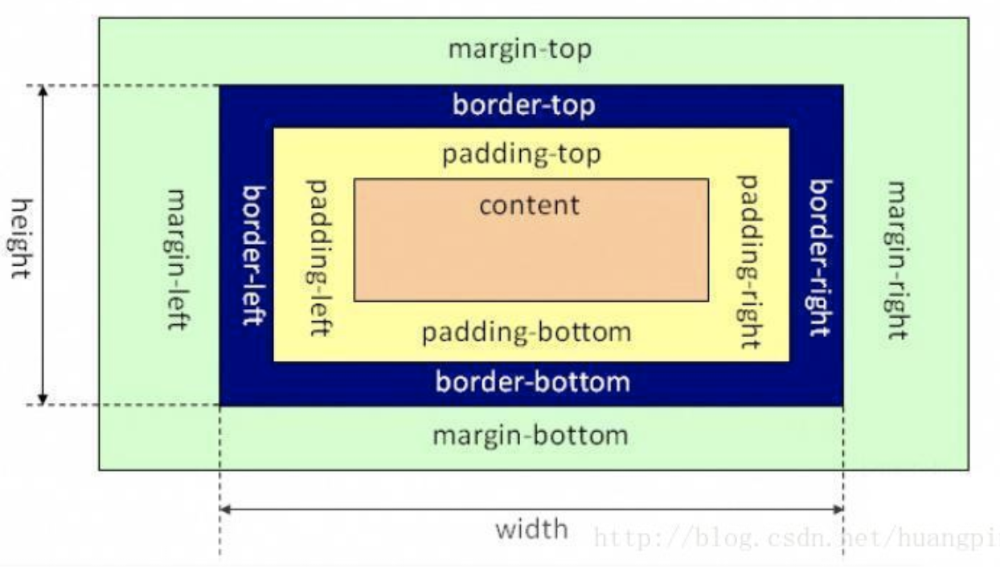
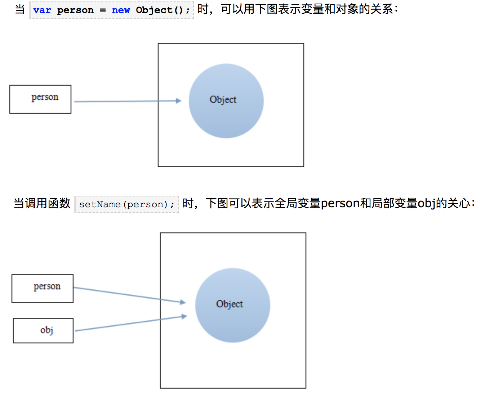
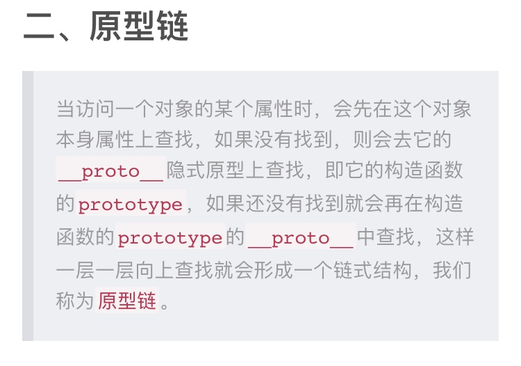
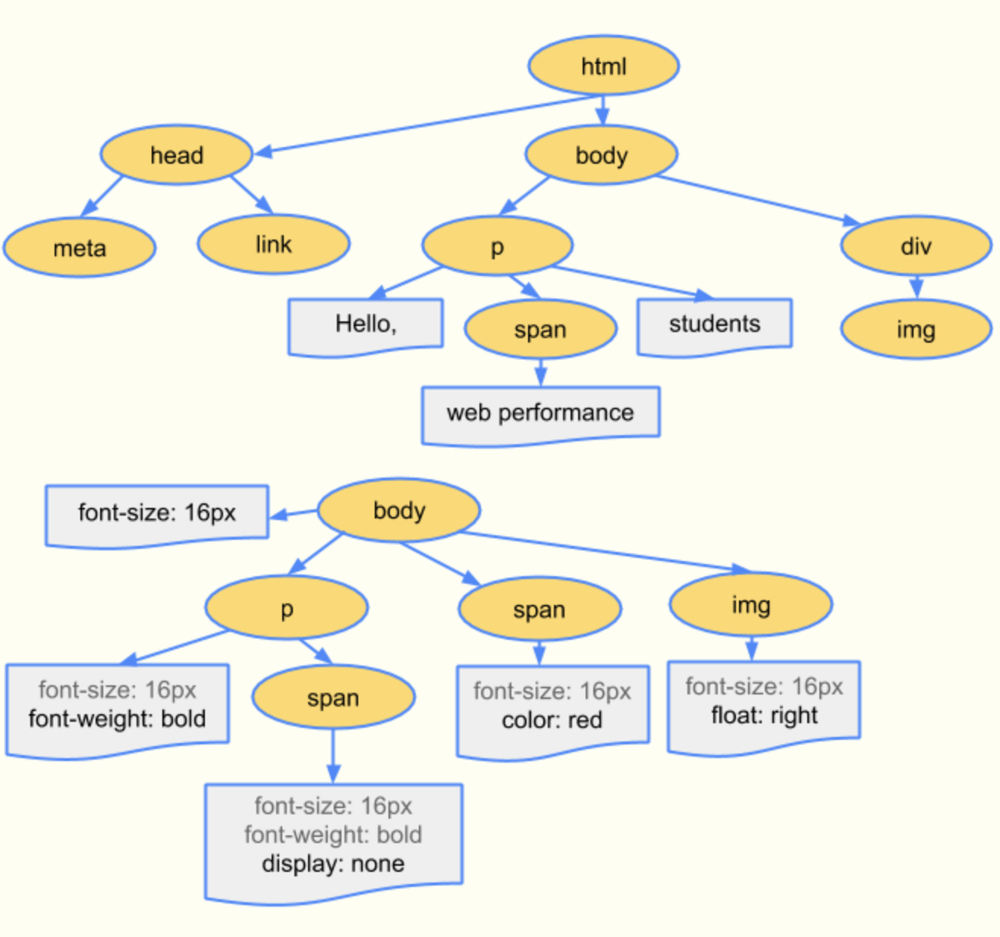
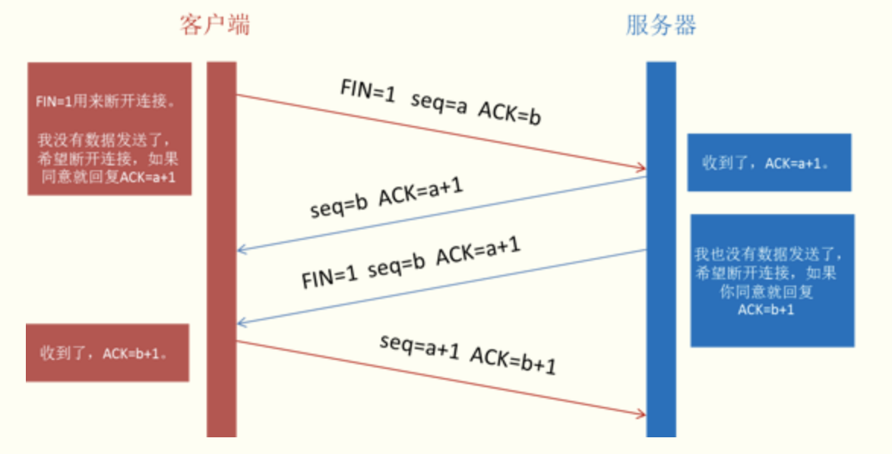
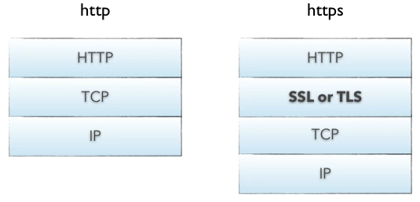

# Web前端面试100+问（带解析）

## 全覆盖

- 前端性能优化的方法有哪些？

    1.减少HTTP请求

    - 图片地图
    - css sprites

    2.减少DOM操作

      访问DOM的次数越多，引起浏览器重
     排和重绘的次数也就越多，就会延长整
     个页面的交互事件。

     可以通过事件委托来减少DOM操作

    3.使用浏览器缓存

    - cache-control
    - Etag
    - last-modified

    4.压缩组件

      web客户端可以通过HTTP请求中的Accept-Encoding头来表示对压缩的支持，如果web服务器看到请求中这个头，就会使用客户端列出的方法的一种来进行压缩。通过Content-Encoding来通知客户端。

    5.将样式表放在头部

    不会加快页面加载时间，不过可以减少页面首屏出现的时间，使页面内容逐步呈现，改善用户体验。

    6.将脚本放在底部

    不会加快页面加载时间，不过可以减少页面首屏出现的时间，使页面内容逐步呈现，改善用户体验。

    7.避免css表达式

    8.避免重定向

    9.使Ajax可缓存

      使用get方法可缓存。

    From：[https://www.cnblogs.com/MarcoHan/p/5295398.html](https://www.cnblogs.com/MarcoHan/p/5295398.html)

    10图片懒加载

## HTML

- HTML5有哪些新特性？

    1.语义化标签

    2.音频视频

       <audio></audio>

       <video></video>

    3.canvas绘图

    4.SVG绘图

    5.地理定位 Geolocation

    6.拖拽API

    7.Web worker

    8.web storage

    9.web socket

- canvas和SVG有什么区别？

    SVG 是一种使用 XML 描述 2D 图形的语言。

    Canvas 通过 JavaScript 来绘制 2D 图形。

    

- DOCTYPE的作用？

    浏览器通过DOCTYPE获知文档类型，告诉浏览器文档使用了哪个版本的HTML

## CSS

- 如何去除inline-block带来的空白间隙？

    [https://www.jianshu.com/p/c98281eaa302](https://www.jianshu.com/p/c98281eaa302)

- css中有哪些实现居中的方法？

    [https://www.jianshu.com/p/36a04ad7e7f1](https://www.jianshu.com/p/36a04ad7e7f1)

- 什么是盒子模型？

    把所有的网页元素都看成一个盒子，它具有四个属性margin,border,padding,content。

    

- w3c盒子和IE盒子的区别？

    w3c盒子中的width和height是指content部分的宽度高度；

    

    IE盒子中的width和height指的是content+padding+border的宽度高度

    

- box-sizing属性的值和区别？

    有content-box和border-box

    content-box就是w3c盒子模型，width和height指的是content部分的宽和高度；

    border-box就是IE盒子模型，width和height指的是content+padding+border的宽度和高度。

- position属性有哪些值？

    [https://www.jianshu.com/p/7dcec798e079](https://www.jianshu.com/p/7dcec798e079)

- overflow溢出有哪些属性？

    overflow属性规定了当内容溢出元素框时改如何处理

    默认值：visible

    继承性：no

    - visible 默认值,溢出内容不会被修剪，会呈现在元素框之外
    - hidden 溢出内容会被修剪，并且其余内容不可见
    - scoll   溢出内容会被修剪，但是浏览器会显示滚动条查看其他内容。即使不 
             ，也会有滚动条
    - auto  如果溢出内容被修剪，则浏览器会显示滚动条以查看其他内容
    - inherit  从父元素中继承overflow属性的值。
- 浮动与清除的实现？

    [https://www.cnblogs.com/zfquan/p/7793945.html](https://www.cnblogs.com/zfquan/p/7793945.html)

    其中一定要注意：clear清除浮动只能影响使用清除的元素本身，不能影响其他元素。

- 怎么解决子元素使用css float浮动，而父级div没高度不能自适应的问题？
- display:none和visibility:hidden的区别?

    display:none是使元素从文档流中彻底消失，不在文档流中占位置，浏览器也不会解析该元素。

    visibility:hidden是视觉上消失了，可以理解为透明度为0，在文档流中占位置，浏览器会解析该元素。

- 什么是BFC?

    BFC（Block Formatting Context）,块级格式化上下文，它是指一个独立的块级渲染区域，只有块级的盒子参与，该区域拥有一套渲染规则来约束块级盒子的布局，且与区域外部无关。

    [https://www.cnblogs.com/dojo-lzz/p/3999013.html](https://www.cnblogs.com/dojo-lzz/p/3999013.html)，这篇博客还不错，我还没有对BFC理解。

- 什么是外边距塌陷？

    定义：两个块级元素的垂直方向上的外边界有时会被折叠成一个外边距，大小是两个外边距中大的那一个。

    发生外边距塌陷的情况

    1.相邻的兄弟元素

    解决办法：可以利用BFC，两个元素处在同一个BFC中才会折叠，若相邻两个元素不在同一个BFC中，就能避免折叠。

    2.父元素和第一个或者最后一个子元素

    如果父元素没有border,padding和内容的话就会塌陷

    解决办法：

    - 给父元素指定一个border或者padding
    - 给父元素加overflow:hidden

    3.空的块级元素。

- flex弹性布局有哪12个属性？

    容器属性

    - flex-direction：row|row-reserve|column|column-reserve

          轴线方向，即项目的排列方向

    - flex-wrap:no-wrap|wrap|wrap-reserve

         项目的换行方式

    - flex-flow：row no-wrap

         flex-direction和flex-wrap属性的简写

    - justify-content:flex-start|flex-end|center|space-between|space-around

        主轴方向的项目对齐方式

    - align-items:flex-start|flex-end|center|stretch|baseline

       交叉轴方向的项目对齐方式

    - align-content:flex-start|flex-end|center|stretch|space-between|space-around

       多根轴线的对齐方式

    项目属性

    - order 项目排列顺序
    - flex-grow 项目放大比例 默认是0
    - flex-shrink 项目缩小比例，默认是1
    - flex-basis 项目占据的主轴空间大小
    - align-self 允许项目有不一样的对齐方式，覆盖align-items
    - flex:0 1 auto

        flex-grow flex-shrink flex-basis的简写 

- 动画的实现

    通过animation+@key-frames实现流程控制

    通过transition实现过渡

## JS

- js基本数据类型有哪些？

    Undefined,Null,Boolean,String,Number

- JS变量按照存储方式有哪些类型

    基本类型和引用类型

    基本类型名值存储在栈里

    引用类型有数组、对象和函数，名存储在栈里，值存储在堆里，栈内存会提供一个引用的地址指向堆内存的值。

- 实现数组去重的方法有哪些？

    1.遍历数组，使用indexOf,如果返回-1,不在数组中，加入到新数组

        var arr=[1,2,3,4,5,1,1];
            var newArr=[];
            for(var i=0;i<arr.length;i++){
                if(newArr.indexOf(arr[i])==-1){
                    newArr.push(arr[i]);
                }
            }
        
            console.log(newArr);

    2.使用set数据结构

        var arr=[1,2,3,4,5,1,1];
            var newArr=new Set(arr);
            console.log(newArr);

    3.给数组排序，排序后相等的值会相邻，新数组只加入和前一项不相等的值。

        var arr=[1,2,3,4,5,1,1];
            arr.sort();
            var newArr=[arr[0]];
            for(var i=1;i<arr.length;i++){
                if(arr[i]!=newArr[newArr.length-1]){
                    newArr.push(arr[i]);
                }
            }
            console.log(newArr);

- 什么是深拷贝和浅拷贝？

    浅拷贝只是复制了对象的引用地址，复制后两个对象指向同一块内存地址，所以修改其中任意的值，另一个值都会变化。

    深拷贝是将对象和值都复制过来，两个对象修改其中任意的值都不会引起另一个值得变化。

    实现深复制的方法：

    1.递归复制所有层级属性

        

    2.使用JSON对象的parse和stringify

        

    3.使用jQuery的$.extend方法

        

- Ajax的实现流程？

    第一步 创建XMLHttpRequest对象，需要兼容IE7之前的版本，

    通过判断浏览器是否支持ActiveX控件来实现。

     var xhr=new XMLHttpRequest();

    第二步 在异步请求时设置onreadystatechange事件处理程序。

    检查readyState属性的值来实现，其中值为4时，表示已经接收到全部的响应数据，并且可以在客户端使用了。接着判断status状态码，判断响应是否成功来进行下面的步骤。其中responseText 获得字符串形式的响应数据，responseXML获取xml形式的相应数据。

    第三步 使用open方法与服务器建立连接。

    open方法包含三个参数，第一个是请求方法，有get和post两种，如果是post方法，要在设置头部的content-type字段，第二个是url地址，有相对和绝对地址，第三个是一个布尔值，表示是否是异步请求，其中true表示异步。异步表示在send()方法之后，浏览器继续执行，而不等待服务器的响应。

    第四步 向服务其发送数据。

    xhr.send(null);其中post方法参数不为空。

    第五步 使用javascript和dom实现局部刷新。

- 什么是同源策略？

    同一域名、同一协议、同一端口下才能互相访问资源

- 怎么解决跨域问题？

    服务器配置

    jsonp

    原理：通过动态的插入js脚本来实现跨域

    适用：适合获取JSON类型的资源

    缺点：只支持get方法

    特点：允许用户传递一个callback参数给服务器

    websocket

    原理：是一种与服务器全双工、双向通信的通道，不适用http协议，使用自定义的协议

    适用：快速传输小数据

    图像Ping

    缺点：只支持get方法；不能访问服务器的响应文本

    CORS

    思想：就是使用自定义的HTTP头部让浏览器和服务器进行交流，从而决定请求和响应是该成功还是失败

    CORS跨源资源共享，IE通过XDR对象支持跨域资源共享,只支持异步请求；其他浏览器通过XHR对象原生支持跨域资源共享，其中url设置为绝对地址。

    详解：

    浏览器发送一个带有Origin首部字段的HTTP请求，表明请求的来源。服务器的响应头中包含Access-Control-Allow-Origin表明允许哪些域名的请求。一旦不匹配则拒绝访问。通常设置为Access-Control-Allow-Origin: *可以允许任意域名跨域请求该服务器上的资源。

    document.domain

    原理：通过设置两个一级域名相同，二级域名不同的document。domainZ来实现同父域名下的跨域问题。

    window.name

    window.postMessage

    原理：window.postMessage(message, targetOrigin)，是HTML5新引进的特性，可以用来向同源或者不同源的window对象发送消息。插入一个iframe，获取iframe.contentWindow，然后使用postMessage发送消息，在iframe预先设置onmessage的处理函数，即可获取跨域的数据。

- onclick和addEventListener的区别？

    onclick是在DOM0中定义的

    addEventListener是在DOM2中定义的

    addEventListener可以实现一个事件注册多个监听器，不会被覆盖

    addEventListener可以在第三个参数中选择事件捕获还是事件冒泡,false是冒泡

    true是捕获

- 事件冒泡和事件捕获的区别？

    事件冒泡是从内向外，事件捕获是从外向内。

- target和currentTarget的区别？

    target是事件的真正触发者，currentTarget是事件的监听者。

- 什么是事件委托，为什么要用事件委托？

    事件委托利用事件的冒泡原理，委托元素的父级代为执行事件处理程序。

    原因：使用事件委托可以优化性能，因为添加到页面中的事件处理程序程序的数量越多，访问DOM的次数就越多，页面的整体性能越低，使用事件处理程序，只需要与DOM有一次交互，提高性能。

        <head>
            
        </head>
        <body>
            <ul id="ul">
                <li id="li1">111</li>
                <li id="li2">222</li>
                <li id="li3">333</li>
            </ul>
        </body>

- 怎么阻止事件冒泡？

    可以使用event.stopPropagation();方法

        window.onload=function(){
                    var btn=document.getElementById("btn");
                    btn.onclick=function(event){
                        alert("clicked me");
                        var ev=event?event:window.event;
                        ev.stopPropagation();
                    }
        
                    document.body.onclick=function(){
                        alert("clicked body");
                    }
                }

- sessionStorage和localStorage的区别？

    sessionStorage用于在一个浏览器会话中存储数据，在浏览器关闭后就会被立即删除；

    存储在sessionStorage中的数据可以跨越页面刷新而存在，同时如果浏览器支持，浏览器崩溃并重启之后依然可用（Firefox和WebKit都支持，IE则不行。

    通过点击链接（或者用了 window.open）打开的新标签页之间是属于同一个 session 的，但新开一个标签页总是会初始化一个新的 session，即使网站是一样的，它们也不属于同一个 session。

    localStorage用于跨会话持久化数据存储，并且遵守跨域安全策略。

- 如何判断一个变量是数组？

    方法一 通过instanceof来判断，不过必须假定只有一个全局执行环境。

    方法二 通过Array.isArray()方法来判断，被IE9支持。

    

- hasOwnProperty()和in操作符的区别？

    hasOwnProperty(propertyName),用于检查给定的属性在当前对象实例中（不是在实例原型中）是否存在。只在给定属性存在于对象实例中时，才会返回true。

    in操作符通过对象能够访问给定属性时返回true,无论该属性是存在于实例中还是原型中。

- 什么是懒加载？

    懒加载就是JS图片的延迟加载，延迟加载图片或者符合某些条件时才加载某些图片。

    懒加载的主要目的是前端服务器的优化，减少请求数或者延迟请求数

    实现方式：

    第一种是纯粹的延迟加载，使用setTimeOut或setInterval进行加载延迟

    第二种是条件加载，符合某些条件，或触发了某些事件才开始异步下载

    第三种是可视区加载，仅加载用户可见区域，主要是通过监控滚动条来实现。

- js删除数组元素的方法？

    1.splice 会改变原始数组，原来数组的索引也会改变.

    arr.splice(index,len,[item]);

    index索引的位置，len删除/替换的长度，删除操作的话 item为空。

    arr.splice(1,2);

    2.delete 不会改变数组长度，被删除的元素变为undefined

    var arr=['a','b','c','d'];

- splice和slice的区别？

    1.slice(start,end);方法可以从已有数组中返回选定的元素，返回一个新数组，包含从start到end(不包含该元素)的数组元素。

    该方法不会改变原数组。

    2.splice(index,length,item1,...itemX)该方法用于添加或者删除数组中的元素，返回被删除的元素，该方法会改变原数组。

        var arr=[1,2,3,4,5];
        var arr2=arr.slice(1,3);
        console.log(arr2);//2,3
        console.log(arr);//1,2,3,4,5
        
        var arr3=arr.splice(1,3);
        console.log(arr3);//2,3,4
        console.log(arr);//1,5

- For in和for of的区别？

    For in更适合用来遍历对象，for of更适合用来遍历数组。如果用for in遍历数组，遍历的是数组的索引值，for of遍历的是数组的元素值。

- 什么是变量提升？

    变量可以在函数声明之前使用

- setInterval和setTimeout的区别？

    setInterval是间接调用，是循环执行的，即每达到指定的时间间隔就执行相应的函数或者表达式

    setTimeout只运行一次，当达到设定的时间后就运行。

- js单例模式？

    概念：

    保证一个类仅有一个实例，并提供一个访问它的全局访问点。

    实现单例的核心思想：

    用一个变量来标志当前是否已经为某个类创建过对象，如果是，则在下次获取该类的实例时，直接返回之前创建的对象。

- js中函数参数值传递和引用传递的区别？

    我们可以把ECMAScript函数的参数想象成局部变量。在向参数传递基本类型的值时，被传递的值被复制给一个局部变量（即命名参数，或者用ECMAScript的概念来说，就是arguments对象中的一个元素）。在向参数传递引用类型时，会把这个值在内存中的地址（指针）复制给一个局部变量，因此这个局部变量的变化会反映在函数的外部

        function setName(obj){
          obj.name="Nicholas";
        }
        
        var person=new Object();
        setName(person);
        alert(person.name); //Nicholas

    

        function setName(obj){
                    obj.name="Nicholas";
                    obj=new Object();
                    obj.name="Grey";
                }
        
                var person=new Object();
                setName(person);
                console.log(person.name);//Nicholas

- 函数字面量和函数声明的区别？

    函数字面量只有变量提升没有函数提升；

    函数声明有函数提升，在没有声明之前就可以使用。

        console.log(add2(1,2));//3
                function add2(a,b){
                    return a+b;
                }
        
        console.log(add1(1,2));//error,add1 is not a function
                var add1=function(a,b){
                    return a+b;
                }

- 什么是作用域？什么是作用域链？

    函数作用域：在js中，函数的一对花括号会产生一个新的作用域，这个作用域只有函数内部能够访问。

    全局作用域是函数内部也可以访问的。

    作用域链：根据在内部函数可以访问外部函数变量的这种机制，用链式查找决定哪些数据能被内部函数访问。

- 遍历数组的方法有哪些？
    - 普通for循环
    - arr.foreach
    - arr.map
    - for(let i of arr)
    - arr.filter

        var arr=[1,2,3,4,5];
        
                for(var i=0;i<arr.length;i++){
                    console.log(arr[i]);
                }
                
                for(var j=0,len=arr.length;j<len;j++){
                    console.log(arr[j]);
                }
        
                //foreach不能使用break语句中断循环，也不能使用return
                arr.forEach((value,m)=>console.log('forEach遍历：'+m+'--'+value));
                 //map支持return返回值
                 var temp=arr.map((value1,n)=>{
                     console.log('map遍历：'+n+'--'+value1);
                     return value1*value1;
                 });
                 console.log(temp);
        
                 //forof支持return，break,continue;支持大多数类数组；支持字符串遍历
                for(let g of arr){
                     console.log(g);
                 }
        
        
                 let str='happy';
                 for(let s of str){
                     console.log(str[s]);
                 }

- dom 查找节点的方法有哪些？
    - getElementById()
    - getElementsByTagName()
    - getElementsByClassName()
    - getElementsByName()
- bind,apply,call方法的区别？
- Js的单线程引擎和异步的实现方式？

    Js是单线程的，浏览器只分配给js一个主线程，用于执行任务，一次只能执行一个任务，这些任务形成任务队列排队等待执行。浏览器为一些耗时操作，开辟了另外的线程，像是http请求，浏览器定时器触发，浏览器事件触发。这些任务是异步的。异步任务完成后，浏览器通过回调函数通知主线程，主线程再把回调函数放到任务队列里。

- 什么是原型，什么是原型链？

    原型：所有的引用类型都有一个_proto_隐式原型属性，是一个普通对象

    所有函数都有一个prototype属性，是一个普通对象

    所有引用类型的_proto_属性指向它的构造函数的prototype原形。

    原型链：当我们在一个对象查找某个属性时，会先这个对象中查找，如果不存在，就会通过_proto_查找它的隐式原型，也就是对象构造函数的prototype原型，如果还是没有就会在构造函数的prototype的_proto_中查找，这样一层一层的查找就会生成一个链式结构，我们把这个链式结构叫做原型链

    

- 创建对象的方式？

    1.通过对象字面量创建

    2.通过new Object创建

    3.通过function自定义对象

- ==和===的区别？

    ==比较值

    ===比较值和类型

- document.ready和window.onload的区别？

    第一个是dom树构建完成后触发

    第二个是dom树和资源加载完成后触发

    先第一个在第二个

- 数组求和不用for遍历方法?

    Array.reduce方法

    *// 求和*

    var total = [0, 1, 2, 3].reduce( (acc, cur) => acc + cur, 0 );

    *// sum is 6*

- 打开一个新标签页，会不会得到sessionStorage新值？

    如果是通过链接或者window.location打开的，是同一个session，不会有新值

    如果新开一个标签页，会是一个新值。

- 什么时候会发生内存泄露？

    1.循环引用，当dom和js互相引用的时候

    2.Dom内存泄露，当父dom节点被移除，子节点没有被移除时候

    3.计时器可能会有内存泄露

- 怎么用apply,call实现bind？

    原型

- Set 怎么转换为数组？

## HTTP

- 从输入URL到页面加载发生了什么？

    **概述**

    ## 1.浏览器栏输入url地址并按下回车键

    ***url***

    url  协议名：//域名：端口号/路径#hash？查询&查询

    HTTP默认端口号80 

    HTTPS默认端口号443

    FTP 20端口用于连接，21端口用于数据传输

    ## 2.浏览器查找当前url是否存在缓存，并且比较缓存是否过期

    根据是否需要重新向服务器发起请求来分类

    **强制缓存**：cache-control,expires

    expires是一个绝对时间，即服务器时间。浏览器检查当前时间，如果还没到失效时间就直接使用缓存文件。

    cache-control中的max-age保存一个相对时间。例如Cache-Control: max-age = 484200，表示浏览器收到文件后，缓存在484200s内均有效。 如果同时存在cache-control和Expires，浏览器总是优先使用cache-control。

    **对比缓存**：last-madified,Etag

    last-modified是第一次请求资源时，服务器返回的字段，表示最后一次更新的时间。下一次浏览器请求资源时就发送if-modified-since字段。服务器用本地Last-modified时间与if-modified-since时间比较，如果不一致则认为缓存已过期并返回新资源给浏览器；如果时间一致则发送304状态码，让浏览器继续使用缓存。

    Etag：资源的实体标识（哈希字符串），当资源内容更新时，Etag会改变。则再次向web服务器请求时带上头If-None-Match（Etag的值）。web服务器收到请求后发现有头If-None-Match则与被请求资源的相应校验串进行比对，决定返回200或304

    ## 3.DNS解析url对应的IP地址

    **过程**

    例如查找www.baidu.com

    先查找本地hosts文件，找到则返回ip地址

    找不到继续查询本地域名服务器，找到则返回

    找不到本地域名服务器向根域名服务器发送请求，

    如果根域名也没有，本地域名服务器向com顶级域名服务器发请求，

    com域名服务器再到baidu.com域名服务器再到www.baidu.com域名服务器，找到了把ip地址返回给本地域名服务器，本地域名服务器缓存该ip地址，并发送给浏览器，浏览器在本地hosts文件中缓存。

    ## 4.根据IP地址建立TCP三次握手

    **流程**

    客户端发送SYN=1到服务器，等待服务器确认,客户端进入SYN_SENT阶段

    服务器收到后，发送SYN=1,ACK=1，服务器进入SYN_RECV阶段

    客户端收到后，发送确认包ACK=1,客户端和服务器进入ESTABLISHED状态，完成三次握手。

    **原因**

    三次握手的原因是为了防止已经失效的连接请求报文又突然传到服务器，引起错误

    例如 加入采用两次握手 客户端A先发送了一个连接请求报文，因为某种原因没有到达服务器B,接着A又发送了一个连接请求报文，正常到达，建立连接，传输数据，断开。

    结果这时候原来没有到达的连接请求🈶到达了B，于是B发送同意建立的信息给A，B这时就认为连接已经建立了，一直处于等待A发送的过程。

    ## 5.浏览器发起http请求

    完整的请求报文包括，请求起始行，请求头部，请求主体三部分

        POST /index.html HTTP/1.1    |请求方法|请求URI|HTTP版本协议
        Host:www.example.com
        Connect:keep-alive           |可选的请求首部字段
        Content-Length:16            
        
        user=smc&pwd=123             |可选的内容实体
                 

    ## 6.服务器处理请求，浏览器接收http响应报文

    响应报文包含状态码，响应头，响应报文三部分

        HTTP/1.1 200 0K                    |HTTP版本协议|响应状态码|原因短语
        Date:Mon,10 Apr 2018 21:37:00 GMT  |创建响应的时间
        Content-Length:3987                |可选首部字段
        Content-Type:text/html             
        
        <html>                             |资源实体的主体
        ...     

    ## 7.渲染页面，构建DOM树和CSSOM树

    Dom树和CSSOM树

    

    在浏览器还没有接收到完整的HTML文件时，就开始渲染页面了，在遇到外部链入的脚本标签或者样式标签或图片时，会再次发送HTTP请求重复上述步骤。在收到 CSS 文件后会对已经渲染的页面重新渲染，加入它们应有的样式，图片文件加载完立刻显示在相应位置。在这一过程中可能会触发页面的重绘或重排。这里就涉及了两个重要概念：Reflow和Repaint。

    Reflow，也称作Layout，中文叫回流，一般意味着元素的内容、结构、位置或尺寸发生了变化，需要重新计算样式和渲染树。

    Repaint，中文重绘，意味着元素发生的改变只是影响了元素的一些外观之类的时候（例如，背景色，边框颜色，文字颜色等），此时只需要应用新样式绘制这个元素就OK了

    ## 8.关闭TCP连接

    

    **原因：**

    TCP是全双工模式，这就意味着，当主机1发出FIN报文段时，只是表示主机1已经没有数据要发送了，主机1告诉主机2，它的数据已经全部发送完毕了；但是，这个时候主机1还是可以接受来自主机2的数据；当主机2返回ACK报文段时，表示它已经知道主机1没有数据发送了，但是主机2还是可以发送数据到主机1的；当主机2也发送了FIN报文段时，这个时候就表示主机2也没有数据要发送了，就会告诉主机1，我也没有数据要发送了，之后彼此就会愉快的中断这次TCP连接。

- HTTP请求报文和响应报文的基本格式？

    请求报文：

        POST /index.html HTTP/1.1    |请求方法|请求URI|HTTP版本协议
        Host:www.example.com
        Connect:keep-alive           |可选的请求首部字段
        Content-Length:16            
        
        user=smc&pwd=123             |可选的内容实体
                 

    响应报文：

        HTTP/1.1 200 0K                    |HTTP版本协议|响应状态码|原因短语
        Date:Mon,10 Apr 2018 21:37:00 GMT  |创建响应的时间
        Content-Length:3987                |可选首部字段
        Content-Type:text/html             
        
        <html>                             |资源实体的主体
        ...     

- 持久化连接的实现方法及其优点是什么？

    在一个TCP连接中进行多次HTTP请求和响应

    优点：

    1.节省通信量

    2.可以并行发送多个HTTP 请求，加开WEB页面的显示速度

- 如何通过cookie解决客户端状态保存问题？

    第一次HTTP请求，没有cookie信息

        GET /reader HTTP/1.1
        Host: www.example.com

    HTTP响应，服务器生成cookie信息

        HTTP/1.1 200 OK
        Date: Mon, 10 Apr 2017 14:17:00 GMT
        Server: Apache
        Set-Cookie: sid=1342077140226724; path=/; expires=Wed, 10-OCT-12 07:12:20 GMT
        Content-Type: text/plain; charset=UTF-8

    之后再发起请求，客户端会自带cookie信息

        GET /other HTTP/1.1
        Host: www.example.com
        Cookie: sid=1342077140226724

- cookie的最大容量是多少？

    4KB

- cookie有哪些属性？

    服务器响应报文中包含的

    - name                    cookie的名称
    - value                    cookie的值
    - domain                 cookie对于哪些域是有效的
    - path                      可以访问此cookie的页面路径
    - expires  cookie失效时间，默认是和session一起失效，也就是回话结束时
    - size                        cookie的大小
    - secure                   是否只能通过https来传递此条cookie
- Get和Post的区别？

    语义上的区别

    get用于获取资源，post用于传输资源和数据更新

    表面上的区别

    get参数暴露,通过url传输参数；长度有限制

    post参数不暴露，通过内容实体传输数据；长度无限制

    这里的长度限制是指浏览器对URL有长度限制，不是来自HTTP协议的规定

    传输上的区别

    get产生一个TCP传输包，post产生两个数据传输包，浏览器先发送header,服务器响应100，然后浏览器再发送data,服务器响应200 ok

    其他区别

    get可以被收藏为书签，post不可以

    get回退时无影响，post会重新提交数据

    get可以被缓存，post不能被缓存

    get可以保存在浏览器历史中，post不可以

    get只能使用ASCII字符，post没有这个限制

- HTTP和HTTPS的区别？

    http的信息是明文传输，https是具有安全性的ssl加密传输协议

    https协议需要申请证书，支付一定的费用

    两者采用不同的传输方式，端口也不一样，http是80，https是443

    

- Tcp/ip 失败重传是如何重传的

    重传的原因

    1.发送方计时器超时，TCP每发送一个报文段，就对这个报文段设置一次计时器，当计时器超时而没有收到ACK确认时重传

    2.快速重传

    接收方采用的是累计确认ACK，当发送方一连收到3个重复ACK报文时，就立即重传响应的报文而不等定时器超时

- cookie和session有什么区别？

    cookie数据存储在客户的浏览器上，session数据存储在服务器上。

    cookie不是很安全，别人可以分析存放在本地的cookie并进行cookie欺骗，考虑到安全应当使用session

    session会在一定时间内保存在服务器上，当访问增多，会比较占用服务器性能，考虑到减轻服务器性能，应当使用cookie

           建议将登陆信息等重要信息放在session，其他信息如果需要保留，放在cookie

- 页面之间传参的方法?
    - 通过url传递
    - 通过cookie传递
    - 通过webstorage
    - 通过表单传递

## React

- 什么是props?

    props是react组件的输入内容，它们是从父组件传递给子组件的数据。

- props和state的区别？

    props和state的主要区别是props是从父组件传递的，而state是有组件自身管理的，组件不能改变props,但是可以通过this.setState()改变state.

    只有定义为类的组件才可以有状态。

- react的生命周期和生命周期方法？

    生命周期：

    - mounting
    - updating
    - unmounting

    生命周期方法：

    - componentWillMount
    - componentDidMount
    - componentWillReceiceProps
    - shouldComponentUpdate
    - componentWillUpdate
    - componentDidUpdate
    - componentWillUnmounting
- setState和replaceState的区别？

    setState中新状态会和原状态合并；

    replaceState中的新状态会替换掉原来的状态

- refs的作用？

    通过ref属性对render返回的组件进行标记，方便定位这个组件实例。

    ref的形式

        <input ref="myInput"/>

    通过this.refs来访问这个实例

        this.refs.myInput
